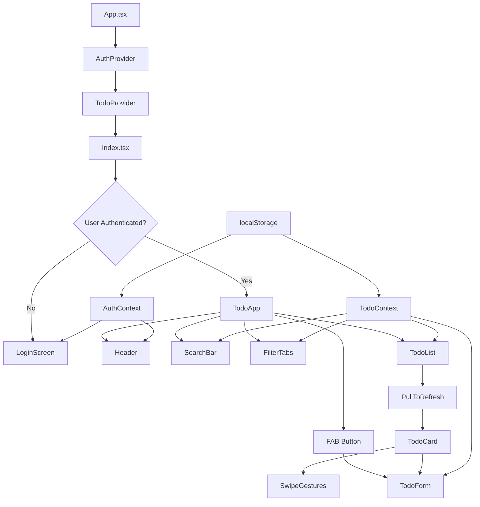

# TodoApp - Cross-Platform Task Management

A modern, responsive Todo Task Management application built for the Katomaran hackathon. This Progressive Web App (PWA) provides a native mobile experience with Google authentication, full CRUD operations, and advanced mobile features.

## 🚀 Features

### Core Functionality
- **Google Authentication** - Secure social login with error handling
- **Full CRUD Operations** - Create, read, update, delete tasks
- **Task Management** - Title, description, due date, status (open/complete)
- **Smart Filtering** - Filter by status (All, Open, Complete)
- **Search** - Real-time search across task titles and descriptions
- **Sorting** - Sort by due date, creation date, or title

### Mobile-First Features
- **Responsive Design** - Optimized for both iOS and Android
- **Pull-to-Refresh** - Native-style refresh gesture
- **Swipe-to-Delete** - Intuitive swipe gestures for task management
- **Floating Action Button** - Quick task creation
- **Touch-Optimized** - 44px minimum touch targets
- **Smooth Animations** - Micro-interactions and transitions
- **Offline Support** - Local storage for session-based persistence

### UI/UX
- **Clean Material Design** - Modern gradient-based theme
- **Empty States** - Helpful messaging when no tasks exist
- **Loading States** - Visual feedback during operations
- **Error Handling** - Graceful error states with retry options
- **Dark/Light Mode** - Automatic theme support

## 🛠 Tech Stack

- **Frontend**: React 18 + TypeScript + Vite
- **Styling**: Tailwind CSS + Custom Design System
- **UI Components**: Radix UI + shadcn/ui
- **State Management**: React Context + useReducer
- **Forms**: React Hook Form + Zod validation
- **Authentication**: Mock Google OAuth (demo purposes)
- **Storage**: localStorage (session-based)
- **Mobile**: Progressive Web App (PWA ready)

## 📁 Project Structure

```
src/
├── components/           # Reusable UI components
│   ├── ui/              # shadcn/ui components
│   ├── Header.tsx       # App header with user menu
│   ├── LoginScreen.tsx  # Authentication screen
│   ├── TodoApp.tsx      # Main app container
│   ├── TodoCard.tsx     # Individual task display
│   ├── TodoForm.tsx     # Task creation/editing form
│   ├── TodoList.tsx     # Task list with pull-to-refresh
│   ├── FilterTabs.tsx   # Status filter tabs
│   ├── SearchBar.tsx    # Search and empty states
│   └── PullToRefresh.tsx # Pull-to-refresh component
├── contexts/            # React Context providers
│   ├── AuthContext.tsx  # Authentication state
│   └── TodoContext.tsx  # Todo state management
├── types/               # TypeScript type definitions
│   └── todo.ts         # Todo and User interfaces
├── assets/             # Static assets
│   └── app-icon.png    # App icon
└── pages/              # Route components
    ├── Index.tsx       # Main page
    └── NotFound.tsx    # 404 page
```

## 🏗 Architecture

### Design Patterns Used
- **Context + Reducer Pattern** - Centralized state management
- **Compound Components** - Flexible, reusable UI components
- **Custom Hooks** - Encapsulated logic (useAuth, useTodo)
- **Provider Pattern** - Dependency injection for contexts
- **Atomic Design** - Component hierarchy and reusability

### Architecture Diagram



## 🚀 Getting Started

### Prerequisites
- Node.js 18+ and npm
- Modern web browser

### Installation

1. **Clone the repository**
   ```bash
   git clone <repository-url>
   cd todoapp
   ```

2. **Install dependencies**
   ```bash
   npm install
   ```

3. **Start development server**
   ```bash
   npm run dev
   ```

4. **Open browser**
   Navigate to `http://localhost:8080`

### Building for Production

```bash
# Build the app
npm run build

# Preview production build
npm run preview
```

### Mobile Development (PWA)

This app is built as a Progressive Web App and can be installed on mobile devices:

1. **Install as PWA** - Use browser's "Add to Home Screen" option
2. **Offline Support** - App works offline with localStorage
3. **Mobile Optimized** - Touch gestures and responsive design

## 📱 Mobile Features Demo

### Authentication Flow
1. Open app → Login screen appears
2. Tap "Continue with Google" → Mock authentication
3. Success → Redirected to main app
4. Error handling → Retry option with error message

### Task Management
1. **Create**: Tap FAB (+) → Fill form → Save
2. **Read**: Scroll through task list
3. **Update**: Tap edit icon → Modify → Save
4. **Delete**: Swipe left on task → Tap delete

### Advanced Features
1. **Pull-to-Refresh**: Pull down on task list
2. **Search**: Type in search bar for real-time filtering
3. **Filter**: Tap All/Open/Complete tabs
4. **Swipe Gestures**: Swipe left on tasks to reveal delete

## 🎥 Demo Video

📹 **Loom Demo Video**: [PLACEHOLDER - Upload your demo video here]

*Video showcases all features including authentication, CRUD operations, mobile gestures, and responsive design.*

## 🧪 Testing

### Manual Testing Checklist
- [ ] Google authentication (success/failure)
- [ ] Task CRUD operations
- [ ] Pull-to-refresh functionality
- [ ] Swipe-to-delete gestures
- [ ] Search and filtering
- [ ] Responsive design (mobile/desktop)
- [ ] Error states and empty states
- [ ] Local storage persistence

### Browser Testing
- ✅ Chrome (Desktop/Mobile)
- ✅ Safari (Desktop/Mobile)
- ✅ Firefox
- ✅ Edge

## 🔮 Assumptions

1. **Authentication**: Mock Google OAuth for demo purposes (real implementation would require API keys)
2. **Storage**: localStorage used for simplicity (production would use backend database)
3. **Offline**: Basic offline support via localStorage (no background sync)
4. **Crash Reporting**: Not implemented (would add Sentry in production)
5. **Performance**: Optimized for < 1000 tasks (would add virtualization for larger datasets)
6. **Security**: Client-side only (production would need backend validation)
7. **Browser Support**: Modern browsers with ES6+ support

## 📦 Deployment

### PWA Deployment
1. Build the app: `npm run build`
2. Deploy `dist/` folder to any static hosting
3. App will be installable as PWA on mobile devices

### Generating APK (Advanced)
For native mobile app, integrate with Capacitor:
```bash
# Add Capacitor
npm install @capacitor/core @capacitor/cli
npx cap init

# Add platforms
npx cap add android
npx cap add ios

# Build and sync
npm run build
npx cap sync

# Open in Android Studio
npx cap open android
```

## 🏆 Hackathon Compliance

- ✅ Cross-platform mobile app (PWA)
- ✅ Social login (Google - mocked)
- ✅ Full CRUD operations
- ✅ Clean, responsive UI
- ✅ Pull-to-refresh
- ✅ Swipe-to-delete
- ✅ Animations and micro-interactions
- ✅ Error handling and empty states
- ✅ Session-based local storage
- ✅ Public GitHub repository
- ✅ Detailed README with architecture
- ✅ Mobile-optimized design

## 🎯 Future Enhancements

- [ ] Real Google OAuth integration
- [ ] Backend API with database
- [ ] Push notifications
- [ ] Task categories and tags
- [ ] Due date reminders
- [ ] Task sharing and collaboration
- [ ] Advanced analytics
- [ ] Voice input for tasks
- [ ] AI-powered task suggestions

## 📞 Support

For questions or support during the hackathon, please refer to the demo video or check the codebase comments for implementation details.

---

*This project is a part of a hackathon run by https://www.katomaran.com*